## T-helper Panel
  

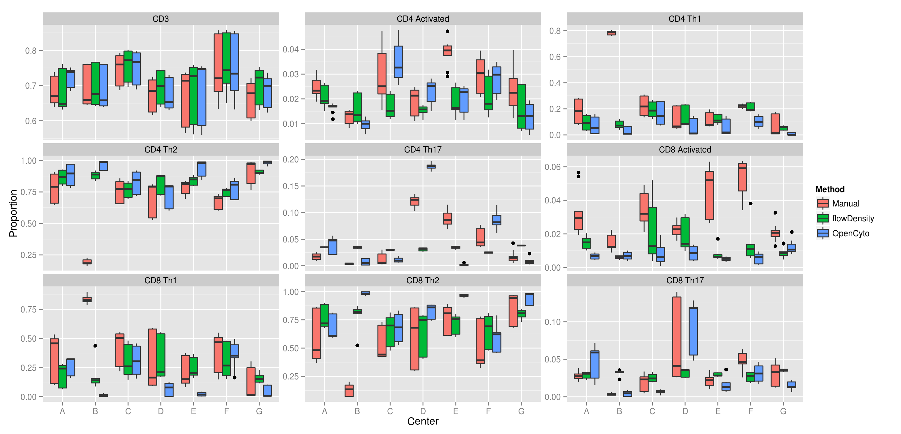

---

## B-cell Panel

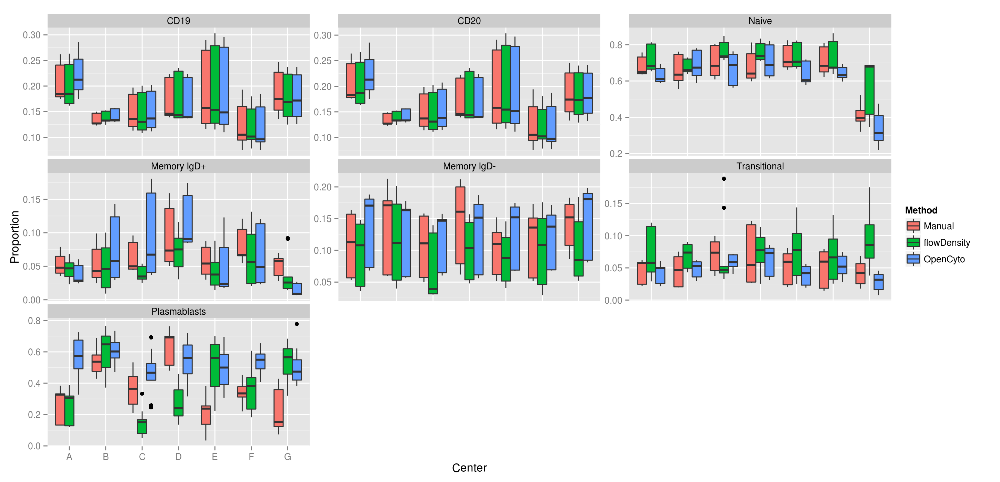

---

## T-cell Panel

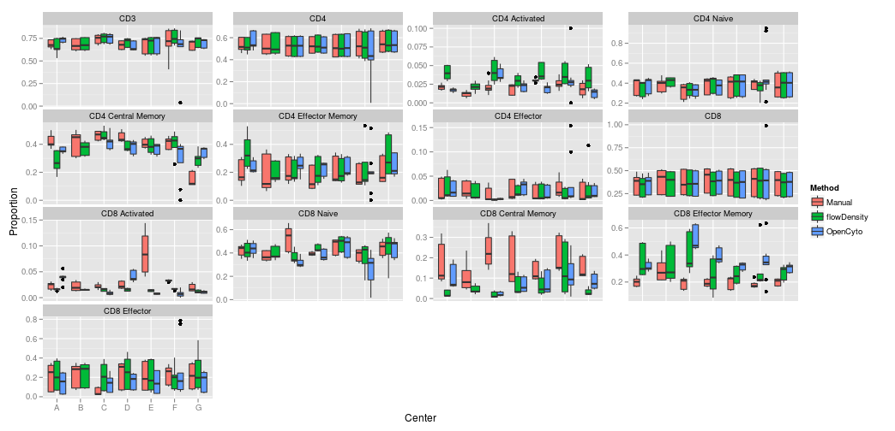

---

## T-reg Panel

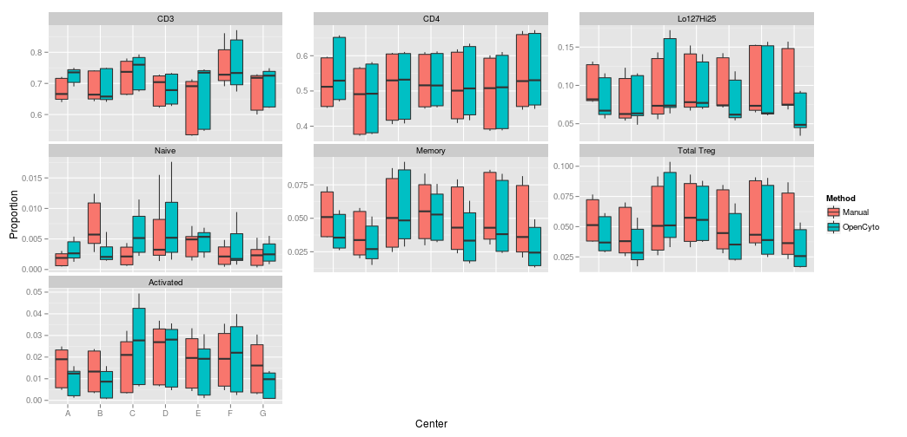

---
  
## Coefficient of Variation for T-cells

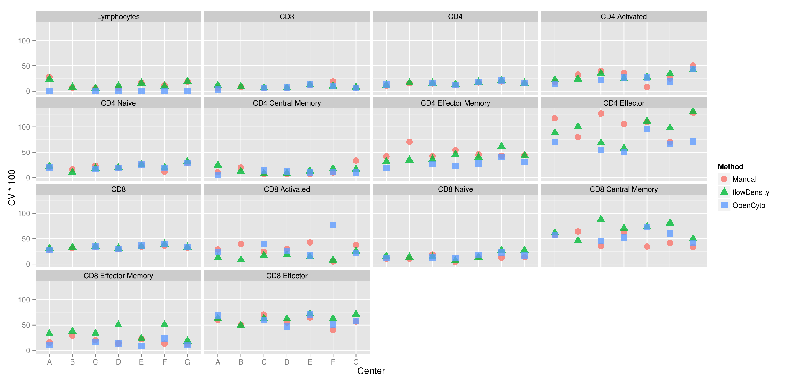

---
  
## Coefficient of Variation for T-helper

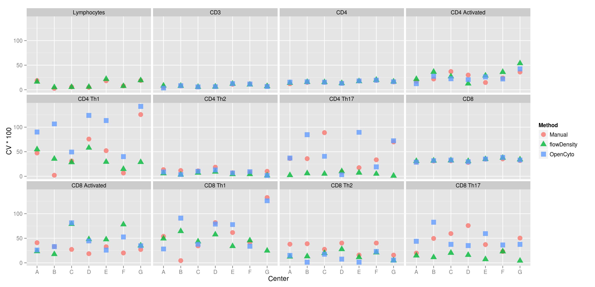

---
  
## Coefficient of Variation for T-regulatory

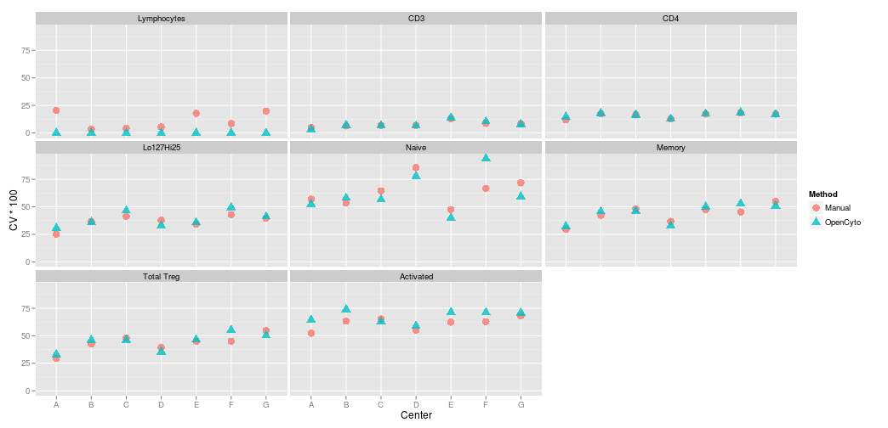

---
  
## Coefficient of Variation for B-cells

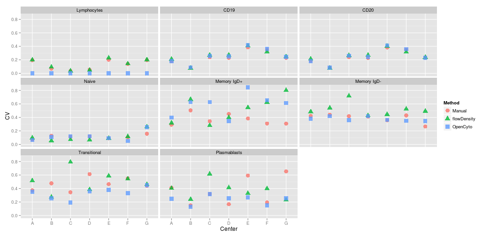

----

## Bias for Bcells

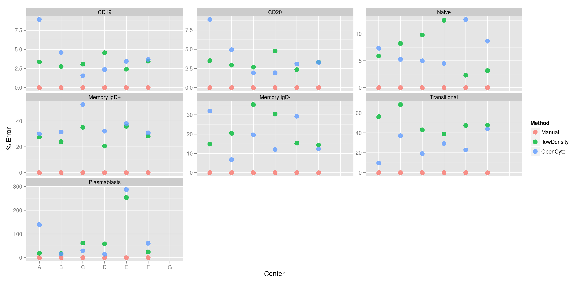

---

## Bias for T-cells
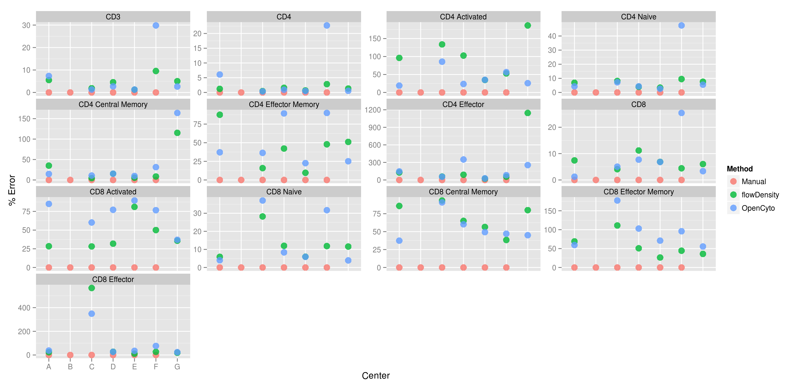

---

## Bias for T-regs
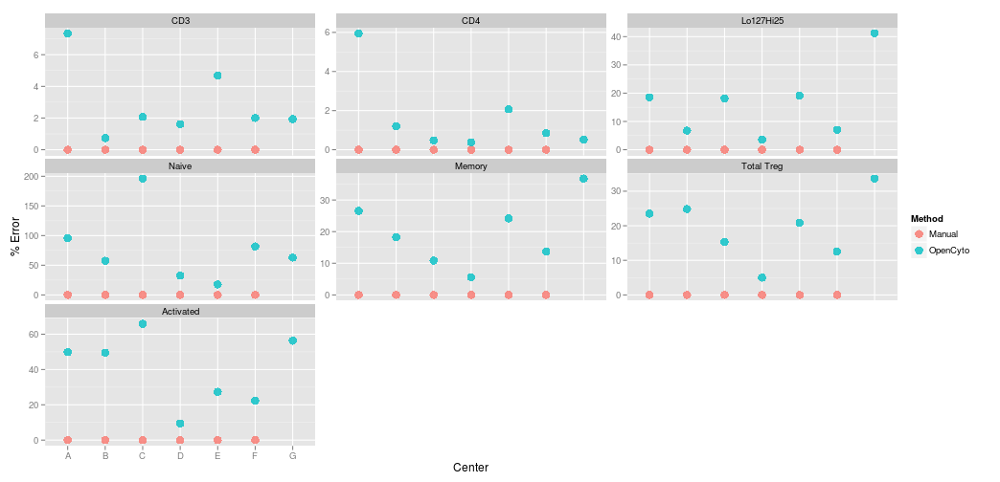

---

## Bias for T-helpers
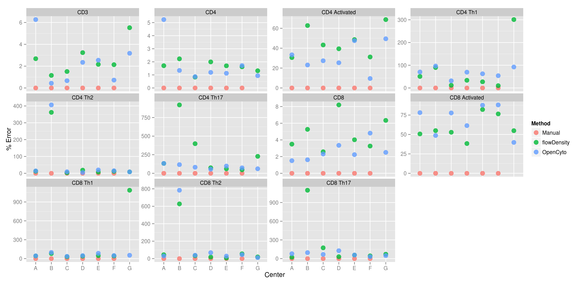

---

## CV Across Centers for T-cells

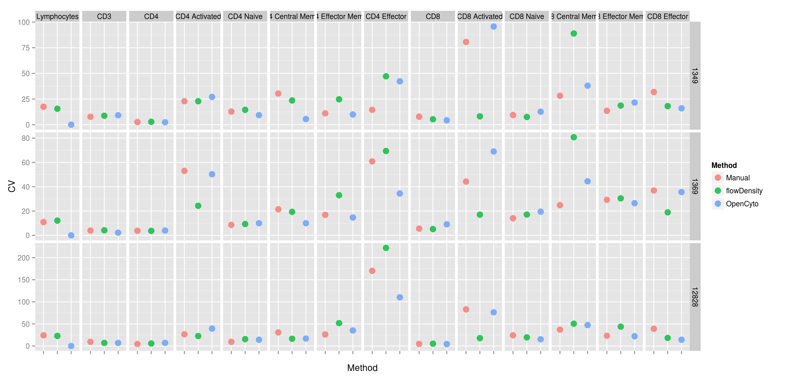

---

## CV Across Centers for B-cells

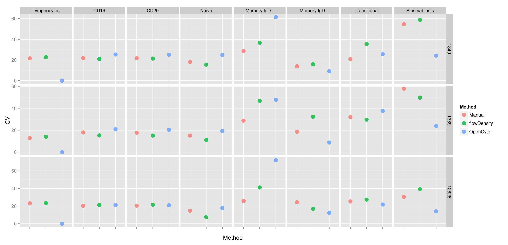

---

## CV Across Centers for T-regs

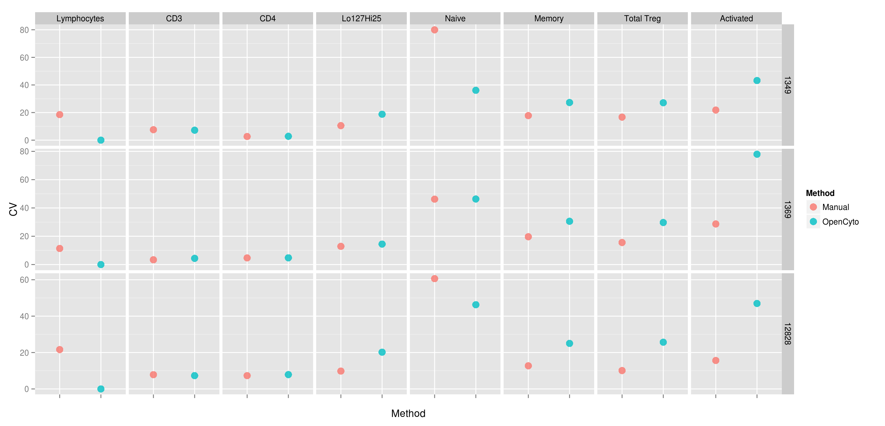

---

## CV Across Centers for T-helpers

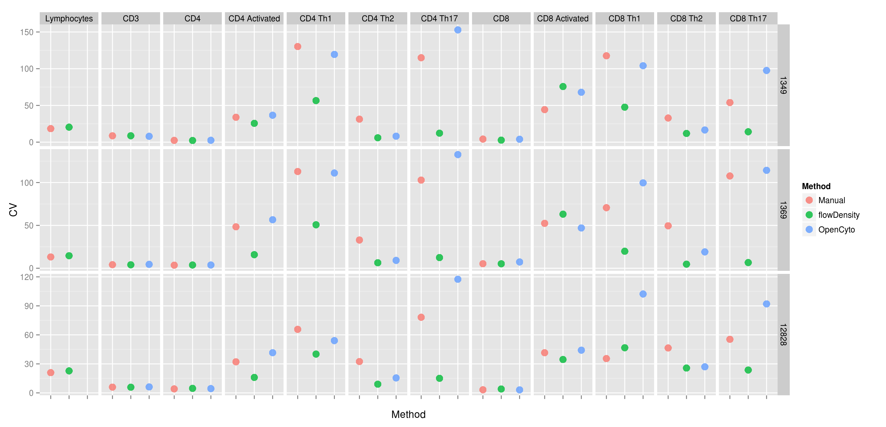

