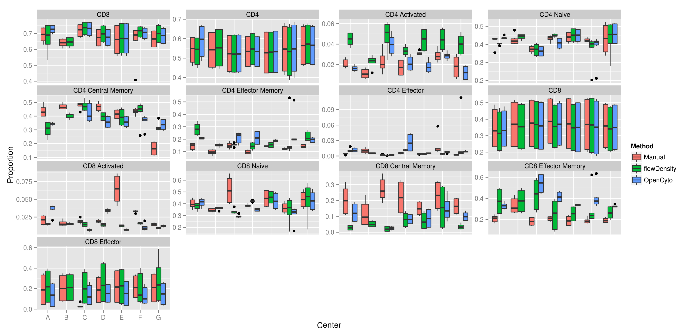
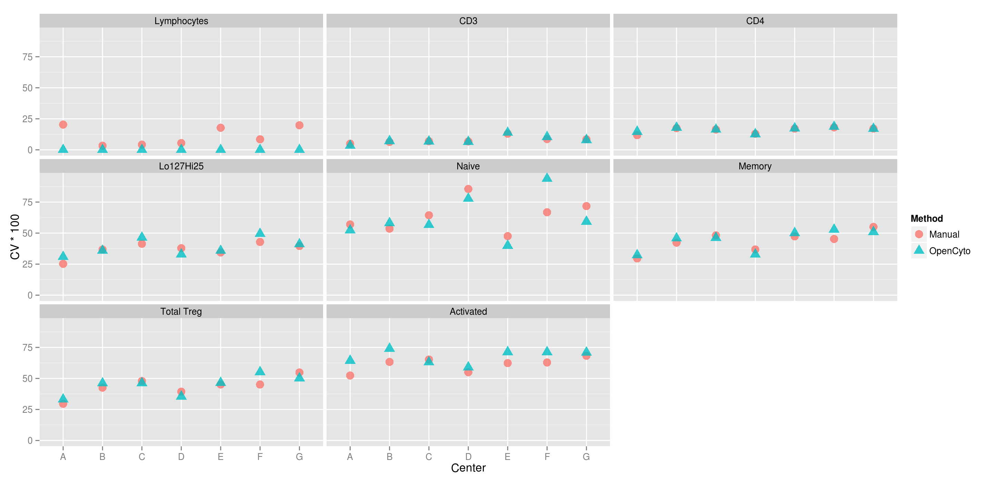
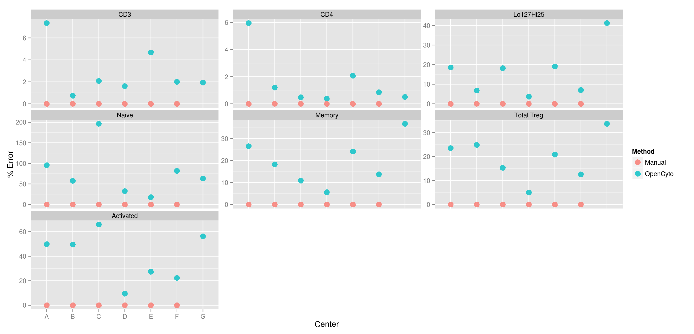

## T-helper Panel
  

---

## B-cell Panel

---

## T-cell Panel

---

## T-reg Panel

---
  
## Coefficient of Variation for T-cells

---
  
## Coefficient of Variation for T-helper

---
  
## Coefficient of Variation for T-regulatory

---
  
## Coefficient of Variation for B-cells

----

## Bias for Bcells

---

## Bias for T-cells

---

## Bias for T-regs

---

## Bias for T-helpers

---

## CV Across Centers for T-cells

---

## CV Across Centers for B-cells

---

## CV Across Centers for T-regs

---

## CV Across Centers for T-helpers

