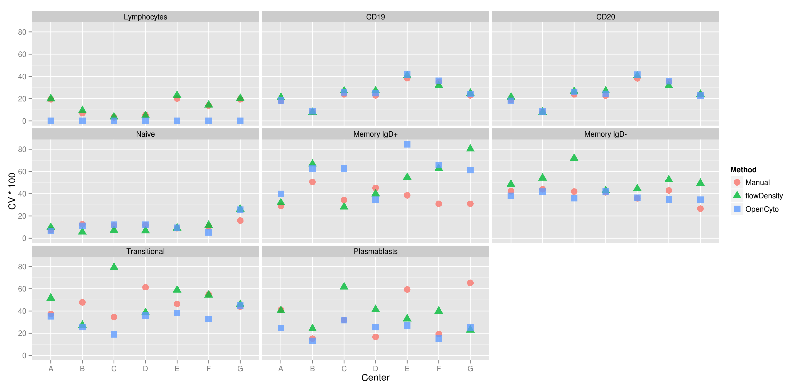

---
title       : Comparison of Automated Gating and Centralized Manual Gating
subtitle    : FOCIS 2013, Cytome Meeting
author      : Ryan Brinkman, Greg Finak and the FlowCAP Committee
job         : 
framework   : io2012        # {io2012, html5slides, shower, dzslides, ...}
highlighter : highlight.js  # {highlight.js, prettify, highlight}
hitheme     : tomorrow      # 
widgets     : []            # {mathjax, quiz, bootstrap}
mode        : selfcontained # {standalone, draft}
---

## T-helper Panel
  

 

---

## B-cell Panel

 

---

## T-cell Panel

 

---

## T-reg Panel

 

---
  
## Coefficient of Variation for T-cells

 

---
  
## Coefficient of Variation for T-helper

 

---
  
## Coefficient of Variation for T-regulatory

 

---
  
## Coefficient of Variation for B-cells

 

